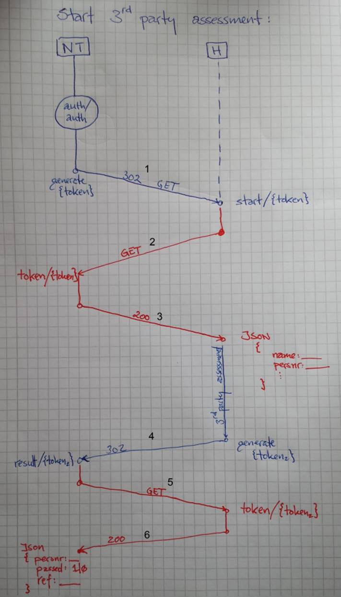

.. coding: utf-8

Design
======

Overføring av data mellom NT og Toolcall
-------------------------------------

Blått er kandidaten/nettleseren, rødt er server-til-server kommunikasjon
over https.

1. Vi autentiserer og autoriserer kandidaten slik at kun kandidater
   som har logget inn og får lov til å ta den eksterne testen blir
   sendt til Toolcall.  Vi genererer et unikt token og redirekter
   kandidaten til en velkjent uri hos Toolcall.
2. Toolcall sender en server-til-server GET over en sikker kanal.
3. Norsk Test returnerer json-data som inneholder kandidatdata som er
   nødvendig for å kjøre den eksterne testen

   a. dette må inkludere en unik personreferanse (Toolcall
      kan f.eks. bruke denne til å tilpasse testen når kandidaten tar
      flere forsøk.)  Personreferansen sendes tilbake i steg #6.
   b. kandidatens navn (for personalisering)

4. Toolcall kjører ekstern test og sender et (nytt) token tilbake til
   Norsk Test

   a. jeg har vist det som en redirekt i diagrammet, slik at
      kandidaten kommer tilbake til portalen, men dette kan også være
      en server-til-server kommunikasjon dersom kandidaten skal gå
      videre i eksternt system etter testen.

5. Norsk Test sender en server-til-server GET over en sikker kanal.
6. Toolcall returnerer json data som inneholder en unik personreferanse
   (mottatt i #3), bestått/ikke-bestått, og en referanse id som kan
   brukes til å spore gjennomføringen i etterkant (bl.a. for
   behandling av klagesaker).

   a. dersom det er relevant kan vi også ta imot %-score (på hele
      testen og/eller “topic” scores).

Token bør være validerbare, f.eks. inneholde en checksum.

Token bør kun være gyldig i en kort tid, dvs. perioden fra 1-2 og 4-5
bør være begrenset. Dette vil forhindre en situasjon hvor en angriper
har et stort sett med gyldige token som kan angripes.

Det bør kun være mulig å løse inn et token 1 gang (forhindrer
replay-attacks).

Token bør likevel lagres (eller logges) slik at det er mulig å debugge
systemet.

Det er mulig å implementere en transformasjon av token (dekryptering)
mellom 1/2 og 4/5 slik at token som går over en åpen kanal må
transformeres før de sendes på en sikker kanal.  Jeg tror ikke dette
er nødvendig.
